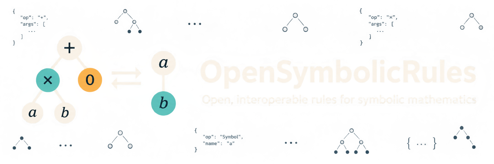

  

OpenSymbolicRules defines open, language-neutral formats for representing
symbolic mathematics rewriting rules independently of any particular
computer algebra system.

Learn more through the [OSR specification](https://github.com/OpenSymbolicRules/Specification)
and its [machine-readable ecosystem manifest](https://github.com/OpenSymbolicRules/Specification/blob/main/ecosystem.json).
